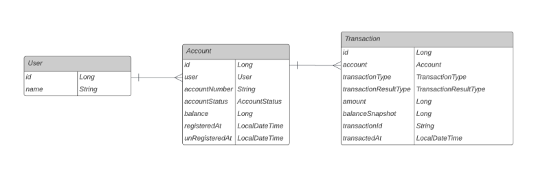

# Account-Project
Account(계좌) 시스템은 사용자와 계좌의 정보를 저장하고 있으며, 외부 시스템에서 거래를 요청할 경우 거래 정보를 받아서 계좌에서 잔액을 거래금액만큼 줄이거나(결제), 거래금액만큼 늘리는(결제 취소) 거래 관리 기능을 제공하는 시스템입니다.

## 활용 기술
- **Framework** : Spring boot 2.6.13 (JDK11)
- **Build** : Gradle
- **DataBase** : H2 Database
- JPA
- Redis
- Lombok
- **Test**
  - Mockito
  - Junit5

## 제공하는 기능(API)
#### 계좌(Account) 관련 기능
1. 계좌 생성
2. 계좌 해지
3. 계좌 확인
#### 거래(Transaction) 관련 기능
1. 잔액 사용(거래 생성)
2. 잔액 사용 취소(거래 취소)
3. 거래 확인
#### 사용자 관련 기능
구현 간소화를 위해 DB에 데이터 자동 입력하도록 구현

## Entity

